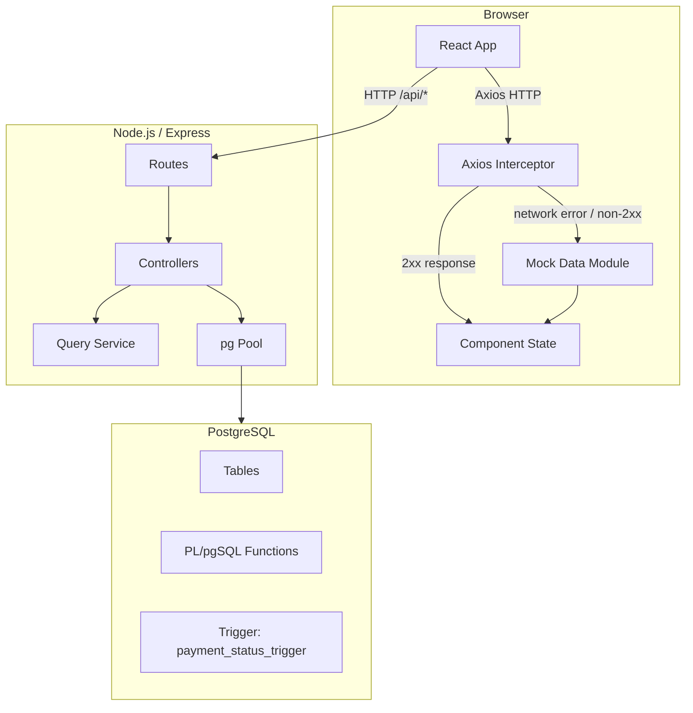
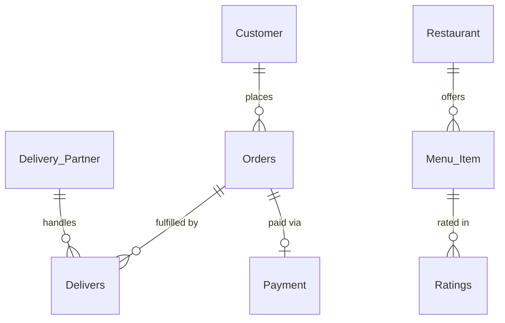

# Design Document — Food Delivery Query Lab

## Overview

Food Delivery Query Lab is a full-stack web application built as a college PostgreSQL mini-project. It presents a cinematic "delivery control room" interface where users can interactively run SQL queries, browse entity data, invoke PL/pgSQL functions, simulate database triggers, and walk through a guided presentation mode for academic evaluation.

The application is split into three layers:

- **Frontend** — React 18 + Vite, Tailwind CSS, Framer Motion, Recharts, lucide-react
- **Backend** — Node.js + Express, `pg` library for PostgreSQL connectivity
- **Database** — PostgreSQL with a food-delivery schema, seed data, PL/pgSQL functions, and a trigger

A key design principle is **graceful degradation**: every data-fetching path has a mock-data fallback so the UI remains fully functional and visually complete even without a live database connection. This is critical for academic demos where the environment may not have PostgreSQL available.

### Key Design Decisions

| Decision | Choice | Rationale |
|---|---|---|
| Frontend bundler | Vite | Fast HMR, minimal config, ideal for React 18 |
| Routing | React Router v6 | Industry standard, supports nested routes |
| HTTP client | Axios | Interceptor support makes mock fallback clean |
| Charts | Recharts | Requirement-specified; composable React components |
| Animations | Framer Motion | Requirement-specified; declarative, performant |
| SQL syntax highlighting | Custom token-based highlighter | No heavy dependency; tailored to the project's color palette |
| Mock fallback strategy | Axios response interceptor | Single interception point; components need no conditional logic |
| State management | React Context + useState/useEffect | Scope is small; no need for Redux/Zustand |

---

## Architecture

The application follows a classic three-tier architecture with an added mock-data layer in the frontend.



### Request Flow

1. A React component calls a service function in `services/api.js`.
2. Axios sends the HTTP request to the Express backend.
3. The Axios response interceptor catches any network error or non-2xx status and substitutes the corresponding mock data entry.
4. The component receives a normalized response object regardless of whether it came from the live API or mock data.
5. If the response came from mock data, a `_isMock: true` flag is included so the UI can show a "Demo Mode" badge.

### Backend Request Flow

1. Express router matches the route and delegates to the appropriate controller.
2. The controller calls the Query Service (for SQL queries) or directly calls the pg Pool (for entity fetches, function calls, trigger simulation).
3. The controller formats the result into the normalized response shape and returns JSON.
4. On database error, the controller returns `{ status: 500, message: "<descriptive error>" }`.

---

## Components and Interfaces

### Frontend Component Tree

```
App
├── FloatingBackground          (global animated particles)
├── Navbar                      (persistent top nav)
└── Routes
    ├── LandingPage
    │   ├── HeroSection
    │   ├── EntityCardGrid      (8 floating entity cards)
    │   └── IsometricCityMap
    ├── Dashboard
    │   ├── KPICard × 3
    │   ├── Sparkline (inside KPICard)
    │   ├── LineChart (Monthly Revenue Trends)
    │   └── BarChart (Orders by Restaurant)
    ├── QueryLab
    │   ├── QueryCard × N       (collapsed list, left panel)
    │   ├── ExpandedQueryCard   (center panel)
    │   │   ├── SyntaxHighlighter
    │   │   ├── RunQueryButton
    │   │   ├── ResultTable
    │   │   └── InsightSummary
    │   └── ExplanationPanel    (right panel, glassmorphism)
    ├── EntityBrowser
    │   ├── EntitySelector      (tabs)
    │   ├── SearchInput
    │   └── ResultTable
    ├── FunctionsPage
    │   ├── FunctionCard × 3
    │   └── OutputPanel
    ├── TriggerDemo
    │   ├── PaymentForm         (BEFORE state)
    │   ├── StateArrow
    │   └── AfterStatePanel     (AFTER state)
    └── PresentationMode
        ├── SlideRenderer
        └── NavigationControls
```

### Key Component Interfaces

#### `KPICard`
```typescript
interface KPICardProps {
  label: string;
  value: number;
  unit?: string;
  sparklineData?: number[];
  isLoading?: boolean;
}
```

#### `QueryCard`
```typescript
interface QueryCardProps {
  id: string;
  title: string;
  category: 'Simple' | 'Complex' | 'Function' | 'Trigger';
  difficulty: 'Easy' | 'Medium' | 'Hard';
  description: string;
  sql: string;
  entities: string[];
  explanation: string;
  insight: string;
  isExpanded: boolean;
  onExpand: (id: string) => void;
}
```

#### `ResultTable`
```typescript
interface ResultTableProps {
  columns: string[];
  rows: Record<string, unknown>[];
  total?: number;
  pageSize?: number;   // default 50
  isLoading?: boolean;
}
```

#### `TriggerDemoState`
```typescript
interface PaymentRecord {
  orderId: number;
  amount: number;
  status: string | null;
}

interface TriggerDemoResponse {
  before: PaymentRecord;
  after: PaymentRecord;
  triggerFired: boolean;
}
```

### Backend Route → Controller → Service Map

| Route | Controller | Service / DB call |
|---|---|---|
| `GET /api/dashboard/kpis` | `dashboardController.getKpis` | Direct pg query |
| `GET /api/dashboard/charts` | `dashboardController.getCharts` | Direct pg query |
| `POST /api/queries/run` | `queryController.runQuery` | `queryService.getQuery(id)` → pg |
| `GET /api/entities/:name` | `entityController.getEntity` | Direct pg query |
| `POST /api/functions/run` | `functionController.runFunction` | pg `SELECT function_name(...)` |
| `POST /api/triggers/payment` | `triggerController.simulatePayment` | pg INSERT into Payment |

### `queryService.js` — Query Registry

All SQL definitions live in a single module. Each entry has the shape:

```javascript
{
  id: 'simple_01',
  title: 'All Customers',
  category: 'Simple',
  difficulty: 'Easy',
  sql: 'SELECT * FROM Customer',
  entities: ['Customer'],
  explanation: 'Returns every row from the Customer table...',
  insight: 'There are 6 customers across 4 cities.'
}
```

---

## Data Models

### Database Schema

The exact schema as specified:

```sql
CREATE TABLE Customer (
  customer_id SERIAL PRIMARY KEY,
  first_name  VARCHAR(50) NOT NULL,
  last_name   VARCHAR(50),
  zip_code    VARCHAR(10),
  apartment_no VARCHAR(20),
  street_name VARCHAR(50),
  city        VARCHAR(50) NOT NULL
);

CREATE TABLE Restaurant (
  restaurant_id   SERIAL PRIMARY KEY,
  restaurant_name VARCHAR(100) NOT NULL,
  street_name     VARCHAR(50),
  state           VARCHAR(50),
  city            VARCHAR(50),
  zip_code        VARCHAR(10)
);

CREATE TABLE Orders (
  order_no    SERIAL PRIMARY KEY,
  customer_id INT REFERENCES Customer(customer_id),
  order_date  DATE,
  quantity    INT CHECK (quantity > 0)
);

CREATE TABLE Menu_Item (
  item_id       SERIAL PRIMARY KEY,
  restaurant_id INT REFERENCES Restaurant(restaurant_id),
  item_name     VARCHAR(100),
  category      VARCHAR(50),
  price         NUMERIC(8,2) CHECK (price > 0),
  availability  BOOLEAN
);

CREATE TABLE Delivery_Partner (
  partner_id   SERIAL PRIMARY KEY,
  partner_name VARCHAR(100),
  location     VARCHAR(100)
);

CREATE TABLE Delivers (
  order_no   INT REFERENCES Orders(order_no),
  partner_id INT REFERENCES Delivery_Partner(partner_id),
  PRIMARY KEY (order_no, partner_id)
);

CREATE TABLE Payment (
  payment_id   SERIAL PRIMARY KEY,
  order_no     INT REFERENCES Orders(order_no),
  amount       NUMERIC(10,2),
  status       VARCHAR(30),
  payment_date DATE
);

CREATE TABLE Ratings (
  rating_id   SERIAL PRIMARY KEY,
  item_id     INT REFERENCES Menu_Item(item_id),
  rating_date DATE,
  comment     TEXT
);
```

### Entity-Relationship Summary



### Seed Data

| Entity | Records |
|---|---|
| Customer | 6 (Sam Shah, Amit Verma, Neha Patel, Rohan Mehta, Priya Singh, Karan Kapoor) |
| Restaurant | 6 (Dominos/Mumbai, KFC/Kolkata, Pizza Hut/Bangalore, Burger King/Pune, Subway/Chennai, McDonalds/Hyderabad) |
| Menu_Item | 6 (Margherita Pizza ₹299, Chicken Bucket ₹499, Veg Supreme Pizza ₹399, Whopper Burger ₹249, Veg Sub ₹199, McAloo Tikki ₹149) |
| Orders | 1 (customer_id=1, 2026-02-20, qty=2) |
| Delivery_Partner | 6 (Rahul/Andheri, Vikas/Pune, Anjali/Bangalore, Suresh/Delhi, Meena/Chennai, Arjun/Hyderabad) |
| Delivers | 1 (order 1 → partner 1) |
| Payment | 1 (order 1, ₹598, Paid, 2026-02-20) |
| Ratings | 1 (item 1, 2026-02-21, "Very good taste") |

### Predefined Queries

#### Simple Queries (10)

| ID | Title | SQL |
|---|---|---|
| `s01` | All Customers | `SELECT * FROM Customer` |
| `s02` | All Orders | `SELECT * FROM Orders` |
| `s03` | Menu Item Prices | `SELECT item_name, price FROM Menu_Item` |
| `s04` | Customers Starting with A | `SELECT * FROM Customer WHERE first_name LIKE 'A%'` |
| `s05` | Customers in Cities Starting with M | `SELECT * FROM Customer WHERE city LIKE 'M%'` |
| `s06` | Mumbai Customers Sorted | `SELECT * FROM Customer WHERE city='Mumbai' ORDER BY first_name` |
| `s07` | Maharashtra Restaurants | `SELECT * FROM Restaurant WHERE state='Maharashtra'` |
| `s08` | February Orders | `SELECT * FROM Orders WHERE EXTRACT(MONTH FROM order_date)=2` |
| `s09` | Order Count | `SELECT COUNT(*) FROM Orders` |
| `s10` | Average Menu Price | `SELECT AVG(price) FROM Menu_Item` |

#### Complex Queries (5)

| ID | Title | Pattern |
|---|---|---|
| `c01` | Most Popular Item | Subquery with Ratings |
| `c02` | Restaurants Avg Price > 300 | JOIN + GROUP BY + HAVING |
| `c03` | Customers Who Never Ordered | NOT EXISTS subquery |
| `c04` | Highest Priced Item per Restaurant | Correlated subquery |
| `c05` | Total Spending per Customer | JOIN Customer + Orders + Payment + GROUP BY |

### PL/pgSQL Functions

```sql
-- 1. Count orders for a customer
CREATE OR REPLACE FUNCTION get_total_orders(cust_id INT)
RETURNS INT AS $$
  SELECT COUNT(*)::INT FROM Orders WHERE customer_id = cust_id;
$$ LANGUAGE sql;

-- 2. Total revenue across all payments
CREATE OR REPLACE FUNCTION total_revenue()
RETURNS NUMERIC AS $$
  SELECT COALESCE(SUM(amount), 0) FROM Payment;
$$ LANGUAGE sql;

-- 3. Average menu item price
CREATE OR REPLACE FUNCTION avg_menu_price()
RETURNS NUMERIC AS $$
  SELECT COALESCE(AVG(price), 0) FROM Menu_Item;
$$ LANGUAGE sql;
```

### Trigger

```sql
CREATE OR REPLACE FUNCTION set_payment_status()
RETURNS TRIGGER AS $$
BEGIN
  IF NEW.amount <= 0 THEN
    NEW.status := 'Invalid';
  ELSIF NEW.status IS NULL THEN
    NEW.status := 'Pending';
  END IF;
  RETURN NEW;
END;
$$ LANGUAGE plpgsql;

CREATE TRIGGER payment_status_trigger
BEFORE INSERT OR UPDATE ON Payment
FOR EACH ROW EXECUTE FUNCTION set_payment_status();
```

### API Response Shapes

All API responses follow normalized shapes so mock data and live data are interchangeable:

```typescript
// GET /api/dashboard/kpis
interface KpisResponse {
  activeOrders: number;       // >= 0
  avgDeliveryTime: number;    // >= 0
  newRestaurants: number;     // >= 0
}

// GET /api/dashboard/charts
interface ChartsResponse {
  orderTrend: { month: string; orders: number }[];
  revenueByRestaurant: { name: string; revenue: number }[];
}

// POST /api/queries/run
interface QueryResponse {
  columns: string[];
  rows: Record<string, unknown>[];
  insight: string;
}

// GET /api/entities/:entityName
interface EntityResponse {
  columns: string[];
  rows: Record<string, unknown>[];
  total: number;              // >= 0
}

// POST /api/functions/run
interface FunctionResponse {
  result: unknown;
}

// POST /api/triggers/payment
interface TriggerResponse {
  before: { orderId: number; amount: number; status: string | null };
  after:  { orderId: number; amount: number; status: string };
  triggerFired: boolean;
}
```

### Mock Data Module Structure

`client/src/data/mockData.js` exports:

```javascript
export const mockKpis = { activeOrders: 1250, avgDeliveryTime: 28, newRestaurants: 42 };
export const mockCharts = { orderTrend: [...], revenueByRestaurant: [...] };
export const mockQueryResults = { s01: { columns, rows, insight }, ... };
export const mockEntities = { customer: { columns, rows, total }, ... };
export const mockFunctions = { get_total_orders: { result: 1 }, ... };
export const mockTrigger = {
  before: { orderId: 1, amount: 0, status: null },
  after:  { orderId: 1, amount: 0, status: 'Invalid' },
  triggerFired: true
};
```

---

## Correctness Properties

*A property is a characteristic or behavior that should hold true across all valid executions of a system — essentially, a formal statement about what the system should do. Properties serve as the bridge between human-readable specifications and machine-verifiable correctness guarantees.*

The prework analysis classified all 60+ acceptance criteria across 15 requirements. The criteria that are amenable to property-based testing fall into these categories: data shape invariants, filter correctness, pagination invariants, trigger logic, and mock fallback universality. Criteria about UI animations, visual styling, and specific one-time interactions are covered by example-based unit tests instead.

After property reflection, the following redundancies were consolidated:
- Requirements 3.4, 4.5, 6.10, 8.6, 9.7, and 10.8 are all instances of the same mock fallback property → consolidated into **Property 7**
- Requirements 5.3 and 5.4 (filter by category, filter by difficulty) → consolidated into **Property 8**
- Requirements 6.6 and 8.3 (table renders columns/rows) are distinct layers (API shape vs UI rendering) → kept separate as **Property 2** and **Property 9**

---

### Property 1: Mock data mirrors API response shape

*For any* API endpoint in the application, the corresponding mock data entry in `mockData.js` SHALL have the same keys and value types as the live API response shape, so that components require no conditional rendering logic beyond the fallback switch.

**Validates: Requirements 14.5**

---

### Property 2: Query result always returns the normalized shape

*For any* query identifier (simple or complex) passed to the query execution path, the result SHALL be an object containing `columns` (non-empty array of strings), `rows` (array of objects), and `insight` (non-empty string).

**Validates: Requirements 6.4, 6.6, 7.1**

---

### Property 3: Entity response always returns the normalized shape with consistent total

*For any* valid entity name passed to the entity fetch path, the result SHALL be an object containing `columns` (non-empty array of strings), `rows` (array of objects), and `total` (non-negative integer) where `total` equals `rows.length`.

**Validates: Requirements 8.2, 8.3, 8.7**

---

### Property 4: Trigger response always returns the normalized shape

*For any* payment input submitted to the trigger simulation path, the result SHALL be an object containing `before` (a payment record object), `after` (a payment record object), and `triggerFired` (a boolean value).

**Validates: Requirements 10.3, 10.4**

---

### Property 5: KPI values are always non-negative numbers

*For any* KPI response object (whether from the live API or mock data), every numeric field — `activeOrders`, `avgDeliveryTime`, and `newRestaurants` — SHALL be a non-negative number (>= 0).

**Validates: Requirements 3.1, 3.3, 3.4, 3.5**

---

### Property 6: Payment trigger enforces status rules for all input combinations

*For any* payment record with an `amount` and `status` value:
- If `amount <= 0`, then the resulting `after.status` SHALL equal `'Invalid'`
- If `amount > 0` and `status` is `null` or an empty string, then the resulting `after.status` SHALL equal `'Pending'`
- If `amount > 0` and `status` is a non-empty string, then the resulting `after.status` SHALL equal the original `status` value unchanged

This property must hold for both the live database trigger and the client-side mock simulation.

**Validates: Requirements 10.3, 10.4, 10.5, 10.8, 13.4**

---

### Property 7: Mock fallback is invoked for any API error on any endpoint

*For any* API endpoint in the application and *for any* error condition (network failure, HTTP 4xx, HTTP 5xx), the Axios interceptor SHALL return the corresponding mock data entry rather than propagating the error to the component, and the response SHALL include `_isMock: true`.

**Validates: Requirements 3.4, 4.5, 6.10, 8.6, 9.7, 10.8, 14.3**

---

### Property 8: Query card filter returns only matching cards for any filter value

*For any* filter value applied to the query card list (whether filtering by `category` or by `difficulty`), every card in the filtered result set SHALL match the applied filter value, and no card that does not match SHALL appear in the result.

**Validates: Requirements 5.3, 5.4**

---

### Property 9: Result table renders all columns and rows from any result set

*For any* result set object with `columns` (array of N strings) and `rows` (array of M objects), the rendered `ResultTable` component SHALL produce exactly N column header cells and exactly M row elements (up to the current page size).

**Validates: Requirements 6.6, 8.3**

---

### Property 10: Result table paginates at exactly 50 rows per page for any large result set

*For any* result set with more than 50 rows, the `ResultTable` component SHALL render at most 50 rows on any single page, and the total number of pages SHALL equal `Math.ceil(rows.length / 50)`.

**Validates: Requirements 6.7**

---

### Property 11: Relationship strip contains all entities listed in any query definition

*For any* query definition object with an `entities` array of length N, the rendered `RelationshipStrip` component SHALL display exactly N entity chips, and each chip's text SHALL match one of the entity names in the `entities` array.

**Validates: Requirements 7.4**

---

### Property 12: Entity search filter returns only rows containing the search string

*For any* search string and *for any* set of entity rows, the filtered result SHALL contain only rows where at least one field value (converted to string) contains the search string as a substring (case-insensitive), and no row that does not satisfy this condition SHALL appear in the filtered result.

**Validates: Requirements 8.4**

---

### Property 13: Unknown routes always redirect to the Landing Page

*For any* path string that does not match a defined application route, the router SHALL redirect the user to the Landing Page (`/`) rather than rendering a blank page or an error.

**Validates: Requirements 1.3**

---

### Property 14: SyntaxHighlighter produces distinct color tokens for all SQL token types

*For any* SQL string containing at least one keyword, one table name, one string literal, and one numeric literal, the `SyntaxHighlighter` component SHALL produce output where each token type is assigned a visually distinct color class, and no two token types share the same color class.

**Validates: Requirements 6.2**

---

### Property 15: All eight entity cards are rendered on the Landing Page

*For any* list of entity definitions passed to the `EntityCardGrid` component, the rendered output SHALL contain exactly as many entity cards as there are entries in the list, and each card SHALL display the corresponding entity name.

**Validates: Requirements 2.3**

---

## Error Handling

### Frontend Error Handling

| Scenario | Behavior |
|---|---|
| Network error / non-2xx from backend | Axios interceptor substitutes mock data; component renders normally with "Demo Mode" badge |
| Query execution error (backend returns 500) | Error message displayed inside expanded query card; card stays open |
| Function call error | Error message displayed in output panel |
| Unknown route | React Router redirects to Landing Page |
| Empty result set | Result table renders with headers and a "No results" row |

### Backend Error Handling

| Scenario | Behavior |
|---|---|
| Database query fails | Controller catches error, returns `{ message: "<error detail>" }` with HTTP 500 |
| Unknown query ID in `POST /api/queries/run` | Returns HTTP 400 with `{ message: "Unknown query ID" }` |
| Unknown entity name in `GET /api/entities/:name` | Returns HTTP 400 with `{ message: "Unknown entity" }` |
| Unknown function name in `POST /api/functions/run` | Returns HTTP 400 with `{ message: "Unknown function" }` |
| Database unreachable at startup | Logs warning to console; server continues running |

### Axios Interceptor Pattern

```javascript
// services/api.js
axios.interceptors.response.use(
  (response) => response.data,
  (error) => {
    const url = error.config?.url ?? '';
    const mockData = resolveMockData(url, error.config);
    return Promise.resolve({ ...mockData, _isMock: true });
  }
);
```

The `resolveMockData` function maps request URLs to the appropriate mock data entry. This is the single point of fallback logic — no component needs to know whether data is live or mocked.

---

## Testing Strategy

### Overview

The testing strategy uses two complementary approaches:

1. **Unit / example-based tests** — verify specific behaviors, edge cases, and integration points
2. **Property-based tests** — verify universal properties across many generated inputs

Property-based testing is applicable here because the core data contracts (API response shapes, trigger logic, KPI invariants) are pure functions or simple transformations with well-defined input/output behavior and large input spaces.

### Property-Based Testing

**Library**: [fast-check](https://github.com/dubzzz/fast-check) (JavaScript/TypeScript PBT library)

**Configuration**: Minimum 100 iterations per property test.

**Tag format**: `// Feature: food-delivery-query-lab, Property N: <property text>`

Each correctness property maps to exactly one property-based test:

| Property | Test Description | fast-check Arbitraries |
|---|---|---|
| P1: Mock mirrors API shape | For each endpoint key, assert mock entry has same keys/types as API interface | `fc.constantFrom(...endpointKeys)` |
| P2: Query result shape | Generate random query IDs; assert result has `columns`, `rows`, `insight` | `fc.constantFrom(...queryIds)` |
| P3: Entity response shape | Generate random entity names; assert result has `columns`, `rows`, `total === rows.length` | `fc.constantFrom(...entityNames)` |
| P4: Trigger response shape | Generate random payment inputs; assert result has `before`, `after`, `triggerFired` | `fc.record({ orderId: fc.integer(), amount: fc.float(), status: fc.option(fc.string()) })` |
| P5: KPI non-negative | Generate random KPI objects; assert all values >= 0 | `fc.record({ activeOrders: fc.nat(), avgDeliveryTime: fc.nat(), newRestaurants: fc.nat() })` |
| P6: Trigger status rules | Generate random amounts and statuses; assert trigger output matches rules | `fc.record({ amount: fc.float({ min: -1000, max: 1000 }), status: fc.option(fc.string()) })` |
| P7: Mock fallback universality | Generate different error types for different endpoints; assert mock data returned | `fc.tuple(fc.constantFrom(...endpoints), fc.constantFrom('network', '500', '404', '503'))` |
| P8: Query card filter correctness | Generate filter values and query lists; assert filtered results only contain matching cards | `fc.tuple(fc.constantFrom(...categories, ...difficulties), fc.array(queryArb))` |
| P9: Result table renders all columns/rows | Generate result sets with varying columns and rows; assert table renders all | `fc.record({ columns: fc.array(fc.string(), {minLength:1}), rows: fc.array(fc.object()) })` |
| P10: Pagination at 50 rows | Generate result sets with > 50 rows; assert max 50 rendered per page | `fc.array(fc.object(), { minLength: 51, maxLength: 500 })` |
| P11: Relationship strip completeness | Generate query definitions with entity lists; assert strip contains all entities | `fc.record({ entities: fc.array(fc.constantFrom(...entityNames), {minLength:1}) })` |
| P12: Entity search filter | Generate search strings and row data; assert filtered rows all contain search string | `fc.tuple(fc.string({minLength:1}), fc.array(fc.object()))` |
| P13: Unknown routes redirect | Generate random path strings not matching known routes; assert redirect to `/` | `fc.string().filter(s => !knownRoutes.includes(s))` |
| P14: SyntaxHighlighter token colors | Generate SQL strings with all token types; assert distinct color classes per type | `fc.string()` composed with SQL token generators |
| P15: Entity card count invariant | Generate entity lists of varying length; assert rendered card count matches | `fc.array(entityArb, { minLength: 1, maxLength: 20 })` |

### Unit Tests

Unit tests cover:

- **SyntaxHighlighter**: given a SQL string, output contains colored tokens for keywords, table names, strings, numbers
- **ResultTable pagination**: given > 50 rows, only 50 are rendered per page; page navigation works
- **useDebounce hook**: value updates are delayed by the specified ms
- **queryService**: each query ID resolves to an object with all required fields
- **Mock data completeness**: every query ID, entity name, and function name has a corresponding mock entry
- **Trigger controller logic**: unit test the `set_payment_status` equivalent in JS for the mock path

### Integration Tests

- **Backend routes**: use `supertest` to verify each route returns the correct shape with a test database
- **pg Pool connection**: verify the pool connects and disconnects cleanly
- **Trigger end-to-end**: POST to `/api/triggers/payment` with amount=0 and verify `after.status === 'Invalid'`

### Test File Locations

```
client/src/
  __tests__/
    components/
      SyntaxHighlighter.test.jsx
      ResultTable.test.jsx
      KPICard.test.jsx
      RelationshipStrip.test.jsx
      EntityCardGrid.test.jsx
    hooks/
      useDebounce.test.js
      useCounter.test.js
    services/
      api.test.js          (mock fallback behavior — example-based)
    data/
      mockData.test.js     (shape completeness — example-based)
    properties/
      p01_mockMirror.property.test.js        (P1: mock mirrors API shape)
      p02_queryShape.property.test.js        (P2: query result normalized shape)
      p03_entityShape.property.test.js       (P3: entity response normalized shape)
      p04_triggerShape.property.test.js      (P4: trigger response normalized shape)
      p05_kpiInvariant.property.test.js      (P5: KPI values non-negative)
      p06_triggerRules.property.test.js      (P6: payment trigger status rules)
      p07_mockFallback.property.test.js      (P7: mock fallback for any error/endpoint)
      p08_queryFilter.property.test.js       (P8: query card filter correctness)
      p09_tableRender.property.test.js       (P9: result table renders all columns/rows)
      p10_pagination.property.test.js        (P10: pagination at 50 rows)
      p11_relationshipStrip.property.test.js (P11: relationship strip completeness)
      p12_entitySearch.property.test.js      (P12: entity search filter)
      p13_unknownRoutes.property.test.js     (P13: unknown routes redirect)
      p14_syntaxHighlighter.property.test.js (P14: syntax highlighter token colors)
      p15_entityCards.property.test.js       (P15: entity card count invariant)

server/src/
  __tests__/
    routes/
      dashboard.test.js
      queries.test.js
      entities.test.js
      functions.test.js
      triggers.test.js
    services/
      queryService.test.js
```
